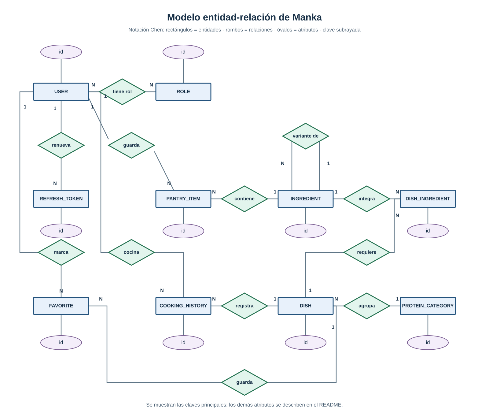
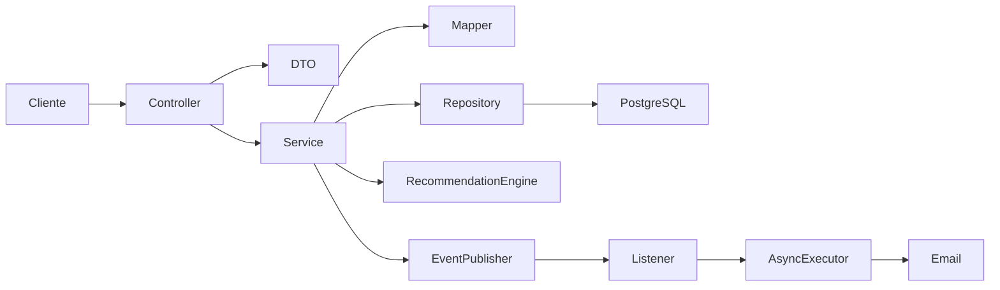

# Manka: backend para decidir qué cocinar

**Curso:** CS 2031 Desarrollo Basado en Plataforma  
**Integrantes:** Juan Carlos Sebastian Lescano Garamendi; Luis Eduardo Strater Mc Lellan; Francisco José Lira Francia; Pablo Cesar Vega del Castillo.  
**Entrega:** Proyecto 1, septiembre de 2026.

## Índice

1. [Introducción](#introducción)
2. [Identificación del problema](#identificación-del-problema)
3. [Descripción de la solución](#descripción-de-la-solución)
4. [Modelo de entidades](#modelo-de-entidades)
5. [Manejo de errores](#manejo-de-errores)
6. [Medidas de seguridad](#medidas-de-seguridad)
7. [Eventos y asincronía](#eventos-y-asincronía)
8. [Endpoints](#endpoints)
9. [Arquitectura](#arquitectura)
10. [Instalación y ejecución local](#instalación-y-ejecución-local)
11. [Despliegue](#despliegue)
12. [GitHub y gestión](#github-y-gestión)
13. [Apuntes en Obsidian](#apuntes-en-obsidian)
14. [Conclusión](#conclusión)
15. [Apéndices](#apéndices)

## Introducción

Manka es una API para ayudar a decidir qué cocinar con los ingredientes que hay en casa y el tiempo disponible. El usuario guarda su despensa, consulta platos y recibe una lista ordenada de recomendaciones. En este repositorio está el backend del proyecto; la colección de Postman permite probarlo sin tener un frontend.

## Identificación del problema

Muchas veces hay ingredientes en casa, pero no está claro qué plato preparar con ellos. Buscar recetas una por una toma tiempo y puede terminar en opciones para las que faltan ingredientes. Además, repetir siempre el mismo plato no resulta muy útil. La idea fue empezar con platos peruanos y ordenar las opciones según lo que cada usuario tiene, cuánto tarda la preparación y lo que cocinó antes.

## Descripción de la solución

Después de registrarse, el usuario añade ingredientes a su despensa e indica cuántos minutos tiene. El sistema puntúa cada plato según cinco criterios: ingredientes disponibles (35 %), tiempo (20 %), variedad de proteína (10 %), repetición reciente (20 %) y popularidad (15 %). Los pesos se pueden cambiar por variables de entorno, siempre que sumen 100 %. La respuesta muestra el puntaje y los ingredientes que faltan. Un plato sin ingredientes registrados no aparece como recomendación.

La API también permite buscar platos por nombre, tiempo y categoría; buscar ingredientes; guardar favoritos; y registrar el historial de cocina. Las listas de platos e ingredientes tienen paginación. Los usuarios con rol `ADMIN` o `MANAGER` pueden administrar el catálogo. El proyecto incluye un catálogo inicial de platos peruanos para probar las recomendaciones.

Usamos Java 25, Spring Boot 3.5.4, Spring Web, Spring Data JPA, Spring Security y PostgreSQL. Las pruebas usan H2; Maven, Docker y Postman sirven para ejecutar y revisar el proyecto. Springdoc genera la documentación OpenAPI y la interfaz Swagger UI. Las contraseñas se guardan con BCrypt y los JWT se generan con JJWT. Esta entrega se centra en el backend hecho en Spring Boot con PostgreSQL en Railway.

## Modelo de entidades



[Abrir el diagrama Chen a tamaño completo](assets/modelo-chen.svg). Los rectángulos representan entidades, los rombos relaciones y los óvalos atributos; la clave principal de cada entidad está subrayada. Los números `1` y `N` indican la cardinalidad. Se muestran las claves principales para que el dibujo siga siendo legible.

| Entidad | Atributos principales |
| --- | --- |
| `User` | `id`, `name`, `email`, `passwordHash`, `enabled`, `createdAt` |
| `Role` | `id`, `name` |
| `RefreshToken` | `id`, `tokenHash`, `expiresAt`, `revoked`, `createdAt` |
| `Ingredient` | `id`, `name`, `parentIngredient` |
| `Dish` | `id`, `name`, `totalTimeMinutes`, `proteinCategory` |
| `ProteinCategory` | `id`, `name` |
| `DishIngredient` | `id`, `dish`, `ingredient` |
| `PantryItem` | `id`, `user`, `ingredient`, `addedAt` |
| `Favorite` | `id`, `user`, `dish`, `createdAt` |
| `CookingHistory` | `id`, `user`, `dish`, `cookedAt` |

`Dish` guarda nombre y tiempo de preparación; `Ingredient` guarda nombre y puede apuntar a otro ingrediente para representar variantes, como pechuga de pollo y pollo. `DishIngredient` une platos con ingredientes y evita relaciones duplicadas. `ProteinCategory` agrupa platos. `PantryItem`, `Favorite` y `CookingHistory` guardan información propia de cada usuario, incluida la fecha de la acción. `User` tiene nombre, correo, contraseña codificada y roles; `RefreshToken` guarda vencimiento y revocación de la sesión. Las relaciones usan claves foráneas y restricciones de unicidad. Para las respuestas HTTP usamos DTOs y no exponemos las entidades directamente.

## Manejo de errores

El proyecto usa `GlobalExceptionHandler` para que los errores tengan el mismo formato: fecha, código, tipo, mensaje y ruta. Devuelve 400 si los datos son inválidos, 401 si falla la autenticación, 403 si faltan permisos, 404 si no existe el recurso y 409 si hay un duplicado o una restricción de datos. Los errores inesperados reciben 500 sin mostrar detalles internos. También validamos los DTOs con `@Valid` y anotaciones como `@NotBlank`, `@Email` y `@Positive`.

## Medidas de seguridad

Al registrarse, una cuenta recibe el rol `USER`. `MANAGER` y `ADMIN` pueden editar el catálogo; solo `ADMIN` puede cambiar roles. Spring Security verifica los JWT y los permisos de cada operación. Los access tokens duran poco y los refresh tokens se pueden revocar. El secreto JWT y las contraseñas de la base se configuran fuera del repositorio. CORS acepta los orígenes configurados. La API usa Bearer tokens, por eso no mantiene sesiones HTTP ni usa cookies para autenticar. Las consultas con JPA y los DTOs ayudan a evitar inyección SQL y exposición de contraseñas; el frontend deberá escapar el texto que muestre para evitar XSS.

## Eventos y asincronía

Se publican eventos cuando alguien se registra, cocina un plato o agrega un favorito. Los listeners se ejecutan después de guardar la operación en la base, para no procesar eventos de cambios que fallaron. El correo de bienvenida, la confirmación de cocina y el registro de actividad se ejecutan con `@Async`. Así la respuesta de la API no espera al correo. Si el envío falla, se registra el error. El correo está desactivado por defecto y requiere configurar SMTP para usarlo.

## Endpoints

La colección [postman_collection.json](postman_collection.json) incluye las solicitudes, ejemplos de respuesta y una breve descripción de cada ruta. La variable `{{baseUrl}}` usa Railway; para probar localmente se cambia a `http://localhost:8080`. La colección usa `{{accessToken}}` para las rutas protegidas. Registro, login, renovación de token y salud son públicos. Todas las rutas de la API empiezan con `/api/v1`, salvo Actuator.

La documentación generada se puede consultar en [Swagger UI](https://mankadbp-production.up.railway.app/swagger-ui.html) y el contrato OpenAPI en formato JSON está en [`/v3/api-docs`](https://mankadbp-production.up.railway.app/v3/api-docs).

| Recurso | Rutas y métodos | Acceso principal |
| --- | --- | --- |
| Auth | `POST /auth/register`, `/login`, `/refresh`, `/logout` | Público |
| Users | `GET /users/me`, `GET /users`, `PATCH /users/{id}/roles` | Usuario / ADMIN |
| Dishes | `GET`, `GET /{id}`, `POST`, `PUT /{id}`, `DELETE /{id}` | Lectura pública; escritura ADMIN/MANAGER |
| Ingredients | `GET`, `GET /{id}`, `POST`, `PUT /{id}`, `DELETE /{id}` | Lectura pública; escritura ADMIN/MANAGER |
| Protein Categories | `GET`, `GET /{id}`, `POST`, `PUT /{id}`, `DELETE /{id}` | Lectura pública; escritura ADMIN/MANAGER |
| Dish Ingredients | `GET`, `GET /{id}`, `POST`, `PUT /{id}`, `DELETE /{id}` | Lectura pública; escritura ADMIN/MANAGER |
| Pantry, Favorites, Cooking History | `GET`, `POST`, `DELETE /{id}` | Usuario autenticado |
| Recommendations | `GET /recommendations?availableMinutes=45&limit=10` | Usuario autenticado |
| Status / Health | `GET /status`, `GET /actuator/health` | Público |

## Arquitectura



Los controladores reciben las peticiones y validan sus datos. Los servicios contienen las reglas del proyecto y llaman a los repositorios para consultar PostgreSQL. Los mappers preparan las respuestas de la API. La recomendación está separada en criterios pequeños para poder probar cada puntaje. Los eventos dejan el correo y el registro de actividad fuera del flujo principal.

## Instalación y ejecución local

Para ejecutar con contenedores se necesita Docker Compose. Copie `.env.example` a `.env` y cambie `DB_PASSWORD` y `JWT_SECRET` por valores propios. El secreto JWT debe tener al menos 32 bytes. `.env` está excluido de Git. Luego ejecute:

```sh
docker compose up --build -d
docker compose ps
```

Abra `http://localhost:8080/actuator/health` para comprobar que arrancó. También puede importar Postman y cambiar `baseUrl` a esa dirección. Los IDs de la colección son ejemplos; se deben reemplazar por los que devuelva cada `POST`.

Para ejecutar la aplicación fuera de Docker se necesita JDK 25. Levante PostgreSQL con `docker compose up -d db`, configure las variables de `.env` en la terminal o el IDE y cambie `DB_URL` a `jdbc:postgresql://localhost:5432/manka`. Después use el Maven Wrapper incluido:

```sh
./mvnw spring-boot:run
./mvnw clean verify
```

En Windows se usa `mvnw.cmd` en lugar de `./mvnw`. Spring Boot no lee `.env` automáticamente si se ejecuta con Maven. Al iniciar, la aplicación crea los roles y, si el catálogo está vacío, carga platos e ingredientes de ejemplo. `MANKA_SEED_ENABLED` permite desactivar esa carga. Para crear una cuenta administradora en el primer arranque se pueden definir `ADMIN_EMAIL` y `ADMIN_PASSWORD`.

## Despliegue

**URL pública (Railway):** [https://mankadbp-production.up.railway.app/](https://mankadbp-production.up.railway.app/). La instancia pública está de forma temporal en Railway, donde hay un servicio para la API y otro para PostgreSQL con volumen. AWS queda pendiente para una siguiente etapa. La API tiene `/actuator/health` para comprobar que está en línea.

En el servicio de Railway se deben configurar `DB_URL`, `DB_USERNAME`, `DB_PASSWORD`, `JWT_SECRET`, `CORS_ALLOWED_ORIGINS`, `MAIL_HOST` y `MAIL_FROM`; `PORT` lo proporciona la plataforma. El correo se activa con `MAIL_ENABLED` y las demás variables SMTP. `JPA_DDL_AUTO` tiene `update` como valor predeterminado para esta entrega. Las credenciales no se guardan en el repositorio.

## GitHub y gestión

El código se organiza en [GitHub](https://github.com/slesgmd/Manka_DBP), con `main` y la rama `feature/rubric-completion`. Los cambios de esta entrega se registraron desde la cuenta `slesgmd`. Los pendientes se siguieron mediante la rama de trabajo y los commits; no se usó un tablero de Projects ni Issues en este hito. GitHub Actions ejecuta `mvn -B clean verify --file pom.xml` en cada push y pull request, con JDK 25. Las pruebas usan H2, por lo que CI no necesita levantar PostgreSQL.

## Apuntes en Obsidian

Ya hay un avance de explicaciones de las partes del proyecto en una bóveda local de Obsidian. Los enlaces entre notas se pueden ver como un grafo y ayudan a entender cómo se conectan las partes del backend. Planeamos subir esa bóveda, o una guía visual equivalente, cuando esté completa; todavía no hay un enlace público.

## Conclusión

Con Manka se puede registrar una despensa, buscar platos y recibir recomendaciones que indican por qué un plato aparece antes que otro. También se guardan favoritos e historial. El aprendizaje principal fue separar controladores, servicios y repositorios, validar los datos de entrada y probar la seguridad de las rutas. Como siguientes pasos quedan probar con una base PostgreSQL real en CI, usar migraciones para el esquema, conectar el frontend y preparar un despliegue en AWS.

## Apéndices

**Licencia:** MIT, 2026, Juan Carlos Sebastian Lescano Garamendi, Luis Eduardo Strater Mc Lellan, Francisco José Lira Francia y Pablo Cesar Vega del Castillo. Véase [LICENSE](LICENSE).

**Referencias:** materiales de clase de CS 2031; [Spring Boot](https://docs.spring.io/spring-boot/reference/); [PostgreSQL](https://www.postgresql.org/docs/); [Railway](https://docs.railway.com/); [Postman](https://learning.postman.com/docs/use/use-collections/overview).
