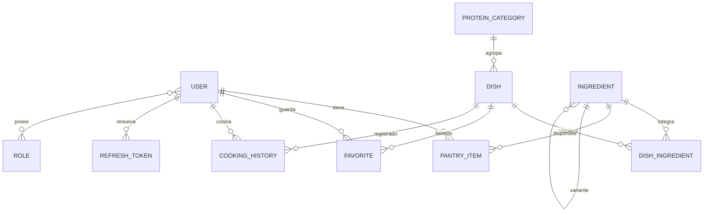
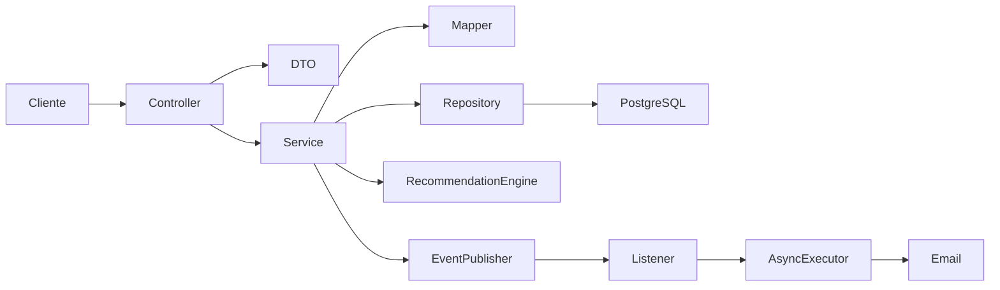

# Manka: backend para decidir qué cocinar

**Curso:** CS 2031 Desarrollo Basado en Plataforma  
**Integrantes:** Juan Carlos Sebastian Lescano Garamendi; Luis Eduardo Strater Mc Lellan; Francisco José Lira Francia; Pablo Cesar Vega del Castillo.  
**Entrega:** Proyecto 1, septiembre de 2026.

## Índice

1. [Introducción](#introducción)
2. [Identificación del problema](#identificación-del-problema)
3. [Descripción de la solución](#descripción-de-la-solución)
4. [Modelo de entidades](#modelo-de-entidades)
5. [Manejo de errores](#manejo-de-errores)
6. [Medidas de seguridad](#medidas-de-seguridad)
7. [Eventos y asincronía](#eventos-y-asincronía)
8. [Endpoints](#endpoints)
9. [Arquitectura](#arquitectura)
10. [Instalación y ejecución local](#instalación-y-ejecución-local)
11. [Despliegue](#despliegue)
12. [GitHub y gestión](#github-y-gestión)
13. [Conclusión](#conclusión)
14. [Apéndices](#apéndices)

## Introducción

Manka ayuda a elegir una comida realizable con los ingredientes disponibles y el tiempo que queda para cocinar. El objetivo principal no es acumular recetas: es presentar opciones ordenadas y explicar por qué una conviene más que otra. Este repositorio contiene la API del proyecto académico. Permite mantener un catálogo de platos e ingredientes, registrar la despensa y el historial individual, y obtener recomendaciones. La colección de Postman incluida facilita recorrer el flujo completo sin depender de una interfaz gráfica.

## Identificación del problema

Al llegar a casa, muchas personas tienen alimentos sueltos, poco tiempo y ninguna decisión tomada. Una búsqueda tradicional por ingrediente puede mostrar recetas que todavía requieren numerosas compras o que tardan más de lo disponible. Tampoco suele considerar que el usuario ya cocinó el mismo plato recientemente. La propuesta original de Manka plantea empezar con preparaciones peruanas y priorizar una decisión rápida y explicable. Resolver este problema reduce desperdicio potencial, hace mejor uso de la despensa y evita revisar manualmente muchas recetas antes de cocinar.

## Descripción de la solución

El usuario autenticado añade ingredientes a su despensa, indica los minutos disponibles y solicita recomendaciones. El motor calcula cinco componentes entre 0 y 100: cobertura de ingredientes, ajuste al tiempo, variedad de proteína, repetición reciente y popularidad a partir de actividad. El puntaje final es `0.35 × cobertura + 0.20 × tiempo + 0.10 × variedad + 0.20 × repetición + 0.15 × popularidad`. Los pesos se configuran por variables y deben sumar 1. Solo se ofrecen platos con cobertura positiva; el resultado incluye porcentaje cubierto, ingredientes faltantes y desglose. Si un plato no tiene ingredientes, su cobertura es cero y no aparece en recomendaciones.

También hay búsqueda de platos por nombre, duración y categoría con paginación; búsqueda paginada de ingredientes por nombre; variantes de ingredientes; favoritos; historial de platos cocinados; y administración del catálogo según rol. Los datos iniciales ofrecen platos peruanos para probar el flujo, pero el catálogo puede ampliarse. El historial y los favoritos alimentan los componentes de repetición y popularidad.

La implementación usa Java 25, Spring Boot 3.5.4, Spring Web, Spring Data JPA, Spring Security, PostgreSQL, H2 para pruebas, Maven, Docker y Postman. Las contraseñas se codifican con BCrypt y los tokens se manejan con JJWT. La propuesta original contemplaba Next.js, Prisma y Supabase; el backend entregado se implementó en Spring Boot y PostgreSQL conforme al curso. No se afirma que el prototipo frontend forme parte de este repositorio ni que se hayan desplegado servicios externos.

## Modelo de entidades



`DishIngredient` representa la relación entre plato e ingrediente y evita duplicados. `Ingredient` permite que una variante apunte a su ingrediente padre. `ProteinCategory` clasifica platos; `CookingHistory` almacena fecha y usuario; `PantryItem` y `Favorite` pertenecen a un usuario. `User` conserva nombre, correo, hash de contraseña y estado; `Role` define permisos, y `RefreshToken` respalda la renovación y revocación. Las entidades usan claves foráneas y restricciones de unicidad; los DTO separan la representación pública de los modelos persistidos.

## Manejo de errores

Un manejador global responde con `timestamp`, `status`, `error`, `message` y `path`. Se utiliza 400 para cuerpos o parámetros inválidos, 401 para credenciales o tokens incorrectos, 403 para acceso sin permiso, 404 para recursos inexistentes y 409 para nombres duplicados o relaciones activas que impiden eliminar. Los errores inesperados reciben 500 sin revelar detalles internos. Las validaciones de DTO impiden nombres vacíos, IDs no positivos y tiempos fuera de rango. Las restricciones de base de datos siguen siendo una última defensa, incluso si dos solicitudes concurrentes superan las comprobaciones previas.

## Medidas de seguridad

El registro asigna el rol `USER`; los roles `MANAGER` y `ADMIN` habilitan cambios de catálogo, y solo `ADMIN` gestiona roles de usuarios. El acceso se valida con JWT de corta duración y refresh tokens rotativos. Las claves, credenciales de base de datos y configuración SMTP proceden del entorno, no del repositorio. La sesión HTTP es stateless. CORS limita los orígenes configurados; no debe usarse un comodín en producción. CSRF está deshabilitado porque la API usa tokens Bearer y no una sesión basada en cookies. Las consultas JPA parametrizadas y la serialización de DTO reducen la exposición de datos y los riesgos de inyección. La interfaz que consuma el API deberá escapar contenido no confiable para prevenir XSS.

## Eventos y asincronía

Al registrar un usuario, marcar un plato como cocinado o añadir un favorito se publican eventos personalizados que extienden `ApplicationEvent`, siguiendo el patrón del laboratorio. Los listeners actúan después del commit para no avisar sobre operaciones revertidas. El correo de bienvenida y la confirmación de cocina se envían mediante un ejecutor `@Async`; el registro de actividad de favoritos también es asíncrono. Así, el tiempo de respuesta HTTP no depende de SMTP o del registro secundario. Si falla el correo, `EmailDeliveryException` permite que el manejador de fallos asíncronos lo registre; la operación de negocio ya confirmada no se revierte. El envío está desactivado por defecto.

## Endpoints

Todos los contratos, cuerpos y respuestas de ejemplo están en [postman_collection.json](postman_collection.json). `{{baseUrl}}` apunta inicialmente a `http://localhost:8080` y la autorización de colección usa `{{accessToken}}`. Registro, inicio de sesión, renovación y salud no exigen Bearer. Las rutas tienen prefijo `/api/v1`, salvo Actuator.

| Recurso | Rutas y métodos | Acceso principal |
| --- | --- | --- |
| Auth | `POST /auth/register`, `/login`, `/refresh`, `/logout` | Público |
| Users | `GET /users/me`, `GET /users`, `PATCH /users/{id}/roles` | Usuario / ADMIN |
| Dishes | `GET`, `GET /{id}`, `POST`, `PUT /{id}`, `DELETE /{id}` | Lectura pública; escritura ADMIN/MANAGER |
| Ingredients | `GET`, `GET /{id}`, `POST`, `PUT /{id}`, `DELETE /{id}` | Lectura pública; escritura ADMIN/MANAGER |
| Protein Categories | `GET`, `GET /{id}`, `POST`, `PUT /{id}`, `DELETE /{id}` | Lectura pública; escritura ADMIN/MANAGER |
| Dish Ingredients | `GET`, `GET /{id}`, `POST`, `PUT /{id}`, `DELETE /{id}` | Lectura pública; escritura ADMIN/MANAGER |
| Pantry, Favorites, Cooking History | `GET`, `POST`, `DELETE /{id}` | Usuario autenticado |
| Recommendations | `GET /recommendations?availableMinutes=45&limit=10` | Usuario autenticado |
| Status / Health | `GET /status`, `GET /actuator/health` | Público |

## Arquitectura



Los controladores reciben y validan HTTP; los servicios aplican reglas y transacciones; los repositorios consultan la base. Los mappers forman respuestas sin publicar entidades completas. El motor de recomendación mantiene scorers independientes para poder probar cada criterio. Los eventos separan acciones complementarias del flujo principal.

## Instalación y ejecución local

Se necesitan JDK 25, Maven y Docker con Compose para la opción en contenedores. Copie `.env.example` a `.env` y reemplace la contraseña de PostgreSQL y `JWT_SECRET` por valores locales propios; el secreto JWT debe ser aleatorio y suficientemente largo. `.env` no debe versionarse. Para ejecutar todo el conjunto:

```sh
docker compose up --build -d
docker compose ps
```

Compruebe `http://localhost:8080/actuator/health` e importe la colección Postman. Los IDs de ejemplo de la colección pueden variar; use los que devuelva la API. Para arrancar con Maven, levante solo PostgreSQL con `docker compose up -d db`, exporte las variables de `.env` en la terminal o configúrelas en el IDE, cambie `DB_URL` a `jdbc:postgresql://localhost:5432/manka` y ejecute:

```sh
mvn spring-boot:run
mvn clean test
```

Spring Boot no carga `.env` automáticamente cuando se ejecuta con Maven. El inicializador crea roles y puede crear un administrador si se configuran `ADMIN_EMAIL` y `ADMIN_PASSWORD` antes del primer arranque. Esas credenciales deben ser propias y seguras; después use `/api/v1/auth/login` para obtener su token ADMIN. Si el correo ya existe, el inicializador no cambia su rol. El seed de catálogo se controla con `MANKA_SEED_ENABLED` y solo actúa sobre un catálogo vacío.

## Despliegue

**URL pública:** `[COMPLETAR: URL de AWS]`. Se prevé construir la imagen Docker y ejecutarla manualmente en Amazon ECS, con PostgreSQL administrado en Amazon RDS. Este repositorio no realiza el despliegue ni crea infraestructura. En la tarea de ECS configure `DB_URL`, `DB_USERNAME`, `DB_PASSWORD`, `JWT_SECRET`, `CORS_ALLOWED_ORIGINS`, `MAIL_HOST` y `MAIL_FROM`; ajuste `MAIL_ENABLED`, `MAIL_PORT`, `MAIL_USERNAME`, `MAIL_PASSWORD`, `MAIL_SMTP_AUTH` y `MAIL_STARTTLS` según el proveedor de correo. Con correo deshabilitado, `MAIL_HOST` y `MAIL_FROM` todavía deben estar definidos por el perfil `prod`. Opcionalmente defina `PORT`, `JPA_DDL_AUTO`, `MANKA_SEED_ENABLED`, `ADMIN_EMAIL` y `ADMIN_PASSWORD`. No coloque secretos en la imagen ni en el repositorio.

El JDBC URL admite `jdbc:postgresql://host:5432/dbname` y parámetros adicionales como `?sslmode=require`; para verificar la identidad de RDS, configure certificado y modo SSL apropiado. Abra únicamente la conectividad necesaria entre ECS y RDS, exponga el puerto 8080 del contenedor o el valor de `PORT`, y use `/actuator/health` como comprobación del balanceador. El valor inicial `JPA_DDL_AUTO=update` facilita una base nueva para la entrega académica; en un entorno duradero conviene gestionar migraciones antes de usar `validate`. Falta que el equipo cree RDS, repositorio de imágenes, servicio ECS, DNS/TLS y secretos, publique la imagen y pruebe el flujo externo.

## GitHub y gestión

El workflow `.github/workflows/ci.yml` ejecuta `mvn -B clean verify --file pom.xml` en cada push y pull request, con JDK 25 y caché de Maven. Las pruebas actuales usan H2 aislado; no necesitan un contenedor PostgreSQL en CI. No hay despliegue automático a AWS en el workflow. **Tablero y organización:** `[COMPLETAR: enlace a Projects o herramienta de gestión]`. **Seguimiento:** `[COMPLETAR: enlaces a Issues y responsables]`. **Revisión:** `[COMPLETAR: enlaces a Pull Requests y evidencia de revisión]`. Estos datos deben completarse con enlaces reales del equipo; no se presuponen actividades que no constan aquí.

## Conclusión

La API convierte la despensa y el tiempo disponible en recomendaciones ordenadas y explicables, además de conservar historial y favoritos. La separación por capas, las validaciones, la seguridad y las pruebas automatizadas sostienen el flujo principal. El aprendizaje central es que un criterio de recomendación útil depende tanto de los datos del usuario como de una explicación transparente del puntaje. Como trabajo futuro quedan pruebas de integración contra PostgreSQL real, migraciones versionadas, medición de rendimiento con un catálogo mayor y una interfaz de usuario conectada al servicio desplegado.

## Apéndices

**Licencia:** MIT, 2026, Juan Carlos Sebastian Lescano Garamendi, Luis Eduardo Strater Mc Lellan, Francisco José Lira Francia y Pablo Cesar Vega del Castillo. Véase [LICENSE](LICENSE).

**Referencias:** [Spring Boot](https://docs.spring.io/spring-boot/reference/), [JJWT](https://github.com/jwtk/jjwt/blob/main/README.adoc), [PostgreSQL](https://www.postgresql.org/docs/), [Docker Compose](https://docs.docker.com/compose/gettingstarted/), [Amazon ECS](https://docs.aws.amazon.com/AmazonECS/latest/developerguide/ecs-tutorials.html), [Amazon RDS y SSL](https://docs.aws.amazon.com/AmazonRDS/latest/UserGuide/PostgreSQL.Concepts.General.SSL.html), [Postman Collections](https://learning.postman.com/docs/use/use-collections/overview), material del curso CS 2031 en `docs/Material_pdfs/TEO` y `docs/Material_pdfs/LAB`, y la propuesta y rúbrica locales en `docs/Importante`.

**Campos pendientes:** `[COMPLETAR: URL de AWS]`; `[COMPLETAR: enlace a Projects o herramienta de gestión]`; `[COMPLETAR: enlaces a Issues y responsables]`; `[COMPLETAR: enlaces a Pull Requests y evidencia de revisión]`.
